# AccessOps: System Architecture

AccessOps is designed as an autonomous, event-driven Multi-Agent Orchestrator using Node.js and Google's Gemini 2.5 Pro model. The system operates entirely in the background, listening to GitLab events and programmatically injecting code fixes for Accessibility, Security, and Performance without altering core business logic.

Below is the high-level architecture detailing how the components interact.

```mermaid
sequenceDiagram
    participant Dev as Developer
    participant GL as GitLab
    participant WH as Webhook Router (Express)
    participant AS as Agent Service (Node.js)
    participant LLM as Gemini 2.5 Pro

    Dev->>GL: Opens Merge Request
    GL->>WH: POST /api/webhook (MR Event)
    WH->>AS: Trigger Workflow (ProjectID, MrID)
    
    rect rgb(20, 20, 30)
    Note over AS,LLM: Autonomous Agent Loop
    AS->>LLM: "Analyze MR and fix accessibility." (System Prompt)
    
    loop Until Finished
        LLM-->>AS: Tool Call: get_mr_changes()
        AS->>GL: Fetch changed files (API)
        GL-->>AS: Changed files list
        AS->>LLM: Tool Response: [login.html]
        
        LLM-->>AS: Tool Call: get_file_content(login.html)
        AS->>GL: Fetch raw file (API)
        GL-->>AS: File contents
        AS->>LLM: Tool Response: <html>...</html>
        
        Note over LLM: Model analyzes code for WCAG violations
        
        LLM-->>AS: Tool Call: update_file(login.html, newCode)
        AS->>GL: Push commit to branch (API)
        GL-->>AS: Success
        AS->>LLM: Tool Response: Success
        
        LLM-->>AS: Tool Call: leave_comment(summary)
        AS->>GL: Post note on MR (API)
        GL-->>AS: Success
        AS->>LLM: Tool Response: Success
    end
    end
    
    LLM-->>AS: Final Text Response: "Audit complete."
    AS-->>WH: Workflow finished
```

## Component Breakdown

### 1. Webhook Router (`backend/routes/webhook.ts`)
The entry point for the system. It listens for `open`, `update`, and `reopen` events from GitLab Merge Requests. It quickly acknowledges the payload (`202 Accepted`) to prevent GitLab timeouts, and asynchronously kicks off the agent workflow.

### 2. Custom MCP Interceptor (`backend/services/agentService.ts`)
To comply with the hackathon rules, we utilize the official `@modelcontextprotocol/server-gitlab` open-source server. However, we discovered a bug in their implementation where the server returns invalid JSON schemas that violate the strict MCP 1.0 standard, causing Zod validation crashes.

**The Engineering Fix:** Instead of abandoning the official server, we built a custom Node.js `TransportInterceptor`. This component sits between the standard MCP SDK and the child process, intercepting the raw JSON payload in real-time, injecting the missing `type: "object"` fields into the schemas, and then passing the sanitized data to our agent. This ensures 100% hackathon compliance while showcasing advanced systems engineering to overcome open-source limitations.

### 3. Model Orchestration (`@google/genai`)
We use Gemini 2.5 Pro via Vertex AI. The model acts as the "brain", deciding which tools to call and in what order. Because we define strict schemas for the tools, the model consistently formats its outputs correctly, allowing our Node.js server to parse the instructions and execute the GitLab API calls flawlessly.
