# 🏗️ System Architecture

The **A11y Agent** utilizes a modern, event-driven Agentic workflow. Instead of using a traditional static pipeline, the system relies on an autonomous agent loop that observes the environment, plans a course of action, and executes tools recursively until the goal is achieved.

## Core Flow

```mermaid
sequenceDiagram
    participant Dev as Developer
    participant GL as GitLab
    participant WH as Webhook Router (Express)
    participant AS as Agent Service (Node.js)
    participant LLM as Gemini 2.5 Pro

    Dev->>GL: Opens Merge Request
    GL->>WH: POST /api/webhook (MR Event)
    WH->>AS: Trigger Workflow (ProjectID, MrID)
    
    rect rgb(20, 20, 30)
    Note over AS,LLM: Autonomous Agent Loop
    AS->>LLM: "Analyze MR and fix accessibility." (System Prompt)
    
    loop Until Finished
        LLM-->>AS: Tool Call: get_mr_changes()
        AS->>GL: Fetch changed files (API)
        GL-->>AS: Changed files list
        AS->>LLM: Tool Response: [login.html]
        
        LLM-->>AS: Tool Call: get_file_content(login.html)
        AS->>GL: Fetch raw file (API)
        GL-->>AS: File contents
        AS->>LLM: Tool Response: <html>...</html>
        
        Note over LLM: Model analyzes code for WCAG violations
        
        LLM-->>AS: Tool Call: update_file(login.html, newCode)
        AS->>GL: Push commit to branch (API)
        GL-->>AS: Success
        AS->>LLM: Tool Response: Success
        
        LLM-->>AS: Tool Call: leave_comment(summary)
        AS->>GL: Post note on MR (API)
        GL-->>AS: Success
        AS->>LLM: Tool Response: Success
    end
    end
    
    LLM-->>AS: Final Text Response: "Audit complete."
    AS-->>WH: Workflow finished
```

## Component Breakdown

### 1. Webhook Router (`backend/routes/webhook.ts`)
The entry point for the system. It listens for `open`, `update`, and `reopen` events from GitLab Merge Requests. It quickly acknowledges the payload (`202 Accepted`) to prevent GitLab timeouts, and asynchronously kicks off the agent workflow.

### 2. Native Agent Service (`backend/services/agentService.ts`)
The orchestrator of the agent loop. Instead of relying on a black-box cloud GUI or an unstable open-source MCP server, this service natively binds Google GenAI tools to standard REST API calls. 

**Tools Exposed to Gemini:**
- `get_mr_changes`: Discovers the scope of work.
- `get_file_content`: Reads the source code in memory.
- `update_file`: Applies the patched code back to the repository.
- `leave_comment`: Provides audit transparency to the human developers.

### 3. Model Orchestration (`@google/genai`)
We use Gemini 2.5 Pro via Vertex AI. The model acts as the "brain", deciding which tools to call and in what order. Because we define strict schemas for the tools, the model consistently formats its outputs correctly, allowing our Node.js server to parse the instructions and execute the GitLab API calls flawlessly.
