# AccessOps: System Architecture

AccessOps is designed as an autonomous, event-driven Multi-Agent Orchestrator using Node.js and Google's Gemini 2.5 Pro model. The system listens to GitLab events, guards against infinite self-trigger loops, and programmatically injects code fixes for Accessibility, Security, and Performance. It leverages a Vite proxy / Nginx frontend to visualize structured events and uses a Google Service Account to log compliance reports.

## Sequence 1: Autonomous Agent Loop & Anti-Loop Guards

This sequence highlights the robust two-layer self-trigger prevention mechanism and the structured WebSocket events that power the frontend visualizations.

```mermaid
sequenceDiagram
    participant Dev as Developer
    participant GL as GitLab
    participant WH as Webhook Layer (Backend)
    participant AS as Agent Service (Backend)
    participant Nginx as Frontend (Vite/Nginx Proxy)
    participant LLM as Gemini 2.5 Pro

    Dev->>GL: Opens / Updates Merge Request
    GL->>WH: POST /api/webhook (MR Event)
    
    rect rgb(50, 20, 20)
    Note over WH: Anti-Loop Guard (Layer 1)
    WH->>WH: Check if author == "rapid-dev-agent"
    end
    
    WH->>AS: triggerAgentWorkflow()
    AS->>Nginx: WebSocket (workflow:start)
    Nginx->>Dev: Update AgentFlow UI

    rect rgb(50, 20, 20)
    Note over AS,GL: Anti-Loop Guard (Layer 2)
    AS->>GL: Fetch latest commit on branch
    AS->>AS: Verify commit prefix != "[AccessOps]"
    AS->>AS: Verify timeAgo > 60 seconds
    end
    
    rect rgb(20, 20, 30)
    Note over AS,LLM: Multi-Agent Orchestration
    AS->>LLM: System Prompt: "Analyze MR..."
    
    loop Until Audit Complete
        LLM-->>AS: Tool Call: get_file_content(login.tsx)
        AS->>GL: Fetch raw file
        GL-->>AS: File contents
        AS->>Nginx: WebSocket (tool:call)
        
        Note over LLM: Model detects WCAG violations
        
        LLM-->>AS: Tool Call: update_file(login.tsx, newCode)
        AS->>GL: Push commit with "[AccessOps]" prefix
        AS->>Nginx: WebSocket (tool:result)
        Nginx->>Dev: Update Monaco Diff Editor
    end
    end
    
    LLM-->>AS: Final Text Response
```

## Sequence 2: Compliance Metrics & Reporting

After the agent successfully resolves the MR, it aggregates runtime metrics and securely generates compliance documentation.

```mermaid
sequenceDiagram
    participant AS as Agent Service (Backend)
    participant Nginx as Frontend (Vite/Nginx Proxy)
    participant GW as Google Workspace (Service Account)
    participant GL as GitLab

    AS->>AS: Aggregate ROI (Tokens, Time Saved)
    
    rect rgb(20, 30, 20)
    Note over AS,GW: Headless JWT Authentication
    AS->>GW: generateComplianceReport()
    GW-->>AS: Google Docs URL
    AS->>GW: logMetricsToSheet()
    GW-->>AS: Google Sheets URL
    end

    AS->>GL: Post MR Note: "Audit Complete. Report: [URL]"
    AS->>Nginx: WebSocket (workflow:complete, metrics)
    Nginx->>Dev: Render Live Metrics & Toast Notification
```

## Component Breakdown

### 1. Webhook Router & Guard (`backend/routes/webhook.ts`)
The system entry point. Acknowledges payloads immediately (`202 Accepted`) to prevent timeouts. It features the **Layer 1 Anti-Loop Guard**, blocking MR events generated by the agent's own service account.

### 2. Custom MCP Interceptor (`backend/utils/mcpWrapper.cjs`)
A custom Node.js `TransportInterceptor`. It sits between the standard MCP SDK and the child process, intercepting raw JSON payloads in real-time to dynamically inject missing `type: "object"` fields into invalid open-source schemas, preventing Zod validation crashes.

### 3. Agent Service & Fallbacks (`backend/services/agentService.ts`)
Manages the orchestration via `@google/genai`. It incorporates the **Layer 2 Anti-Loop Guard**, strictly verifying commit histories, prefixes, and `timeAgo` deltas to ensure absolute safety. It emits structured WebSocket events (`workflow:start`, `tool:call`) that the frontend parses.

### 4. Configuration & Integrations (`backend/routes/integrations.ts`)
Manages dynamic token binding via the frontend `IntegrationsModal.tsx`, saving credentials to memory so users do not need to restart the server.

### 5. Google Workspace Service (`backend/services/googleWorkspace.ts`)
Executes JWT-based Service Account authentication to autonomously generate compliance reports and format Google Sheets without requiring 3-legged user OAuth.

### 6. Cloud Run & Nginx Proxy (`frontend/nginx.conf`)
The React frontend connects to the backend through a robust Vite proxy (local dev) or Nginx reverse proxy (production). By mapping `/api/` and `/socket.io/` directly to the backend URL, it bypasses CORS entirely and securely channels WebSockets over a singleton connection.

### 7. Frontend Component Tree (`frontend/src/components/`)
*   **`AgentFlow.tsx`:** Uses React Flow to visualize the Orchestrator delegating to A11y, Security, and Performance nodes.
*   **`CommitGraph.tsx`:** Renders interactive, branch-aware repository timelines.
*   **`RepoFileGraph.tsx`:** Visualizes the project hierarchy.
*   **`IntegrationsModal.tsx`:** A glassmorphic dialog for managing GitLab/Google keys.
*   **`LandingPage.tsx`:** The unified entry view featuring live metrics and toast notifications.
